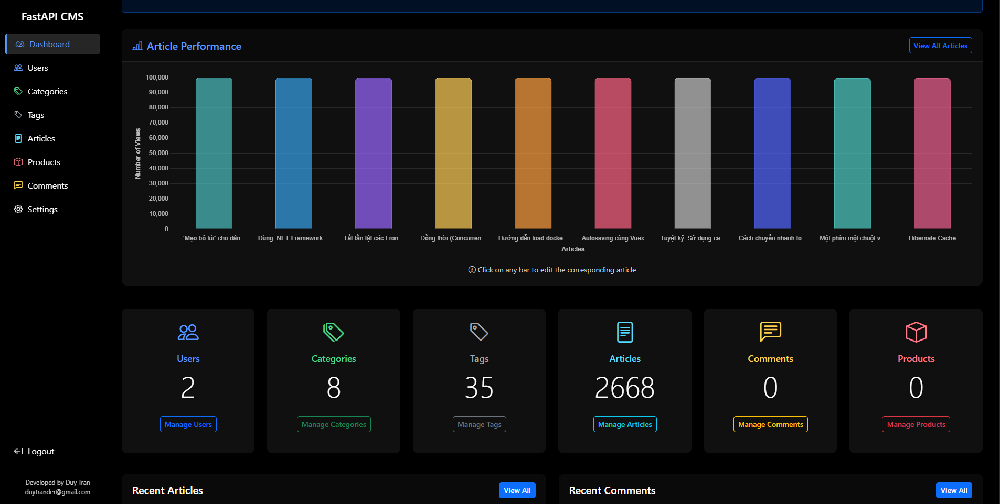

# FastAPI CMS

A modern, high-performance Content Management System built with FastAPI, SQLModel, and Pydantic.



<a href="https://www.buymeacoffee.com/duytrander" target="_blank"></a>
<a href="https://ko-fi.com/duytrandev" target="_blank"></a>

## Features

- **API-first design**: RESTful API endpoints for all resources
- **Admin Dashboard**: Intuitive web interface for content management
- **Authentication**: JWT-based authentication system
- **Content Management**: Articles, categories, tags, comments, and products
- **Database**: SQLite by default, with support for PostgreSQL, MySQL, Oracle, SQL Server and many others
- **Docker Support**: Easy deployment using Docker
- **Responsive Design**: Mobile-friendly admin interface

## Tech Stack

- **FastAPI**: High-performance Python web framework
- **SQLModel**: SQL databases in Python with type checking
- **Pydantic**: Data validation and settings management
- **Jinja2**: Template engine for the admin interface
- **JWT**: JSON Web Token for authentication
- **Alembic**: Database migration tool

## Application Structure

```
fastapi-cms/
├── alembic/           # Database migrations
├── app/               # Main application
│   ├── api/           # API endpoints
│   ├── auth/          # Authentication
│   ├── models.py      # SQLModel models
│   ├── config.py      # Application settings
│   ├── database.py    # Database connection
│   ├── main.py        # Application entry point
│   ├── routers/       # Admin panel routes
│   └── utils/         # Utility functions
├── media/             # User-uploaded files
├── static/            # Static files (CSS, JS, etc.)
├── templates/         # Jinja2 templates
├── .env               # Environment variables
├── .env.example       # Example environment file
├── Dockerfile         # Docker configuration
├── docker-entrypoint.sh # Docker entrypoint script
├── requirements.txt   # Python dependencies
└── alembic.ini        # Alembic configuration
```

## Models

- **User**: Authentication and authorization
- **Category**: Content categorization
- **Article**: Main content type
- **Comment**: User feedback on articles
- **Tag**: Content tagging and filtering
- **Product**: E-commerce product listings with external store links

## Getting Started

### Prerequisites

- Python 3.10+
- pip (Python package manager)

### Installation

1. Clone the repository:

   ```bash
   git clone https://github.com/yourusername/fastapi-cms.git
   cd fastapi-cms
   ```

2. Create a virtual environment:

   ```bash
   python -m venv .venv
   source .venv/bin/activate  # On Windows, use: .venv\Scripts\activate
   ```

3. Install dependencies:

   ```bash
   pip install -r requirements.txt
   ```

4. Create a `.env` file from the example:

   ```bash
   cp .env.example .env
   ```

5. Initialize the database with Alembic:

   ```bash
   alembic revision --autogenerate -m "Initial migration"
   alembic upgrade head
   ```

6. Run the application:

   ```bash
   fastapi dev app/main.py
   ```

7. Access the application:
   - Admin interface: http://localhost:8000/admin
   - API documentation: http://localhost:8000/docs

### Default Admin Credentials

- Username: `admin`
- Password: `admin`

> ⚠️ **Important**: Change the default admin credentials in production by setting `ADMIN_USERNAME`, `ADMIN_EMAIL`, and `ADMIN_PASSWORD` in your `.env` file.

## Docker Deployment

1. Build the Docker image:

   ```bash
   docker build -t fastapi-cms .
   ```

2. Run the container:
   ```bash
   docker run -p 8000:8000 -d fastapi-cms
   ```

## API Endpoints

### Authentication

- `POST /admin/login`: Login to get JWT token
- `POST /admin/logout`: Logout and invalidate token

### Users

- `GET /api/users/`: List all users
- `POST /api/users/`: Create a new user
- `GET /api/users/{user_id}`: Get user details
- `PUT /api/users/{user_id}`: Update user details
- `DELETE /api/users/{user_id}`: Delete a user

### Categories

- `GET /api/categories/`: List all categories
- `POST /api/categories/`: Create a new category
- `GET /api/categories/{category_id}`: Get category details
- `PUT /api/categories/{category_id}`: Update category
- `DELETE /api/categories/{category_id}`: Delete a category

### Articles

- `GET /api/articles/`: List all articles
- `POST /api/articles/`: Create a new article
- `GET /api/articles/{article_id}`: Get article details
- `PUT /api/articles/{article_id}`: Update article
- `DELETE /api/articles/{article_id}`: Delete an article

#### Article Filtering and Pagination

The article listing endpoint (`GET /api/articles/`) supports filtering, sorting, and pagination with the following query parameters:

- `category_id`: Filter by category ID
- `tag_id`: Filter by tag ID
- `author_id`: Filter by author ID
- `published`: Filter by published status (true/false)
- `search`: Search in title and content
- `sort_by`: Sort by field (created_at, updated_at)
- `sort_order`: Sort order (asc, desc)
- `page`: Page number (default: 1)
- `per_page`: Items per page (default: 10, max: 100)

Example responses:

```json
{
  "items": [
    {
      "id": 1,
      "title": "Sample Article",
      "content": "Article content...",
      "published": true,
      "category": {...},
      "author": {...},
      "tags": [...],
      "created_at": "2024-01-01T00:00:00",
      "updated_at": "2024-01-01T00:00:00"
    }
  ],
  "total": 100,
  "page": 1,
  "per_page": 10,
  "total_pages": 10
}
```

Example queries:

- Get published articles: `/api/articles?published=true`
- Search articles: `/api/articles?search=python`
- Filter by category and tag: `/api/articles?category_id=1&tag_id=2`
- Sort by creation date: `/api/articles?sort_by=created_at&sort_order=desc`
- Pagination: `/api/articles?page=2&per_page=20`
- Combined filters: `/api/articles?category_id=1&published=true&search=python&sort_by=created_at&sort_order=desc&page=1&per_page=10`

### Comments

- `GET /api/comments/`: List all comments
- `POST /api/comments/`: Create a new comment
- `GET /api/comments/{comment_id}`: Get comment details
- `PUT /api/comments/{comment_id}`: Update comment
- `DELETE /api/comments/{comment_id}`: Delete a comment

### Tags

- `GET /api/tags/`: List all tags
- `POST /api/tags/`: Create a new tag
- `GET /api/tags/{tag_id}`: Get tag details
- `PUT /api/tags/{tag_id}`: Update tag
- `DELETE /api/tags/{tag_id}`: Delete a tag

### Products

- `GET /api/products/`: List all products
- `POST /api/products/`: Create a new product
- `GET /api/products/{product_id}`: Get product details
- `PUT /api/products/{product_id}`: Update product
- `DELETE /api/products/{product_id}`: Delete a product

## API Documentation

The API documentation is automatically generated using Swagger UI and available at `/docs` endpoint.

## Database Support

FastAPI CMS supports multiple database backends through SQLAlchemy:

### Built-in Support

- **SQLite**: Default, no additional packages needed
- **PostgreSQL/CockroachDB**: Requires `psycopg2` or `psycopg2-binary` and `sqlalchemy-cockroachdb`
- **MySQL/MariaDB**: Requires `pymysql` or `mysqlclient`
- **Oracle**: Requires `cx_Oracle`
- **Microsoft SQL Server**: Requires `pyodbc`
- **Firebird**: Requires `fdb`

### Extended Support (External Dialects)

- **MongoDB**: Requires `pymongo`
- **Cassandra**: Requires `cassandra-driver`
- **IBM DB2**: Requires `ibm_db_sa`
- **SAP HANA**: Requires `hdbcli`
- **Snowflake**: Requires `snowflake-sqlalchemy`
- **Amazon Redshift**: Requires `redshift_connector`
- **Google BigQuery**: Requires `pybigquery`

To use a specific database, update the `DATABASE_URL` in your `.env` file with the appropriate connection string. See the comments in `.env.example` and `app/database.py` for connection string formats.

## Contributing

Contributions are welcome! Please feel free to submit a Pull Request.

## Support

If you find this project helpful, consider buying me a coffee!

<a href="https://www.buymeacoffee.com/duytrander" target="_blank"></a>
<a href="https://ko-fi.com/duytrander" target="_blank"></a>

## License

This project is licensed under the MIT License - see the LICENSE file for details.
